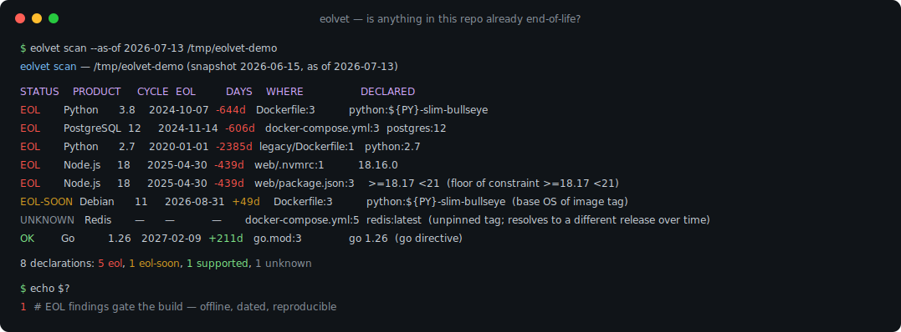
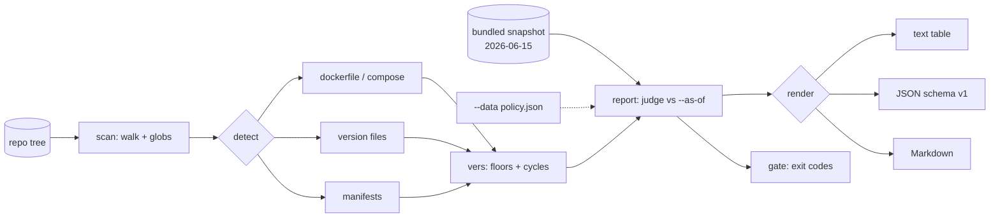

# eolvet

[English](README.md) | [中文](README.zh.md) | [日本語](README.ja.md)

[](LICENSE) [](go.mod) [](CHANGELOG.md)  [](CONTRIBUTING.md)

**eolvet：リポジトリと Dockerfile からサポート終了（EOL）のランタイム・ディストリ・ベースイメージを検出するオープンソースの依存ゼロ CLI——完全オフラインで、バイナリに同梱したバージョン付き EOL スナップショットに基づき、すべての監査回答に日付が付き再現可能。**



```bash
git clone https://github.com/JaydenCJ/eolvet && cd eolvet
go build -o eolvet ./cmd/eolvet    # single static binary, stdlib only
```

> プレリリース：v0.1.0 はまだパッケージレジストリに公開されていません。上記の手順でソースからビルドしてください（Go ≥1.22 なら可）。

## なぜ eolvet か？

2025 年以降の CVE 振り返りはどれも同じ結末を迎えます：脆弱だったのは何か月も前に EOL を迎えていたランタイムやベースイメージで、それに気づく定常的な手段が誰にもなかった、というものです。既存の答えはいずれも同じ二つの問題を抱えています。スキャン時に Web API を呼ぶか（xeol は endoflife.date に問い合わせるため CI に外向き通信が必要で、答えは時間とともに変わり、エアギャップ環境では使えない）、あるいは一つのエコシステム・一種類のファイルしか扱わないか、です。一方でコンプライアンスチームやプラットフォームチームが本当に問いたいのは、地味でリポジトリ単位の問いです：*「この日付時点で、このリポジトリの宣言の中にすでに EOL のものはあるか——そして明日も同じ答えが得られるか？」* eolvet はまさにそれに答えます。リポジトリを走査し、ファイルが実際に宣言している内容——ARG 置換付きのマルチステージ Dockerfile、compose ファイル、`.nvmrc`/`.python-version`/`.tool-versions`、`go.mod`、`package.json` engines、`pyproject.toml`、`Gemfile`、`composer.json`——を読み取り、スナップショット日付の刻印されたバイナリ同梱の EOL 表で各宣言を判定します。ネットワークなし、ドリフトなし：レポートにはどのスナップショットが、どの日付を基準に判定したかが明記され、file:line と宣言の原文引用が添えられます。タグが分解できる場合（`python:3.8-slim-bullseye` は EOL の Python *かつ*期限間近の Debian）は両方の検出結果が得られ、オフラインで解決できないバージョン（`redis:latest`）は推測ではなく説明付きの `unknown` になります。

| | eolvet | xeol | endoflife.date API | 手作業の表計算監査 |
|---|---|---|---|---|
| 完全オフライン / エアギャップ対応 | ✅ 同梱スナップショット | ❌ API 照会 | ❌ それ自体が API | ✅ |
| 再現可能：日付付きスナップショット + `--as-of` | ✅ | ❌ 答えが漂流 | ❌ 答えが漂流 | ❌ 場当たり的 |
| リポジトリのファイルを読む（Dockerfile・マニフェスト・ピン） | ✅ 15 種類 | ⚠️ イメージ/SBOM | ❌ 照会のみ | ❌ 手作業 |
| イメージタグをランタイム + ベース OS に分解 | ✅ | ❌ | ❌ | ❌ |
| 制約の下限（`>=18 <21` → 18 で判定） | ✅ | ❌ | ❌ | ❌ |
| CI 向け終了コード付きポリシーゲート | ✅ `--fail-on`・`--strict` | ✅ | ❌ | ❌ |
| 自組織のライフサイクルポリシー持ち込み | ✅ `--data policy.json` | ❌ | ❌ | ✅ |
| ランタイム依存 | 0（Go 標準ライブラリ） | Go + 要ネットワーク | n/a | n/a |

<sub>2026-07-12 時点で確認：eolvet は Go 標準ライブラリのみをインポート。xeol は最新データの取得にスキャン時の endoflife.date へのアクセスが必要。</sub>

## 主な機能

- **バージョン付き EOL スナップショットをバイナリに同梱** — 21 プロダクト・113 リリースサイクル（Python、Node.js、Go、Java、Ruby、PHP、.NET、Ubuntu、Debian、Alpine、CentOS、Rocky、Alma、Amazon Linux、PostgreSQL、MySQL、MariaDB、MongoDB、Redis、nginx、HAProxy）。ロード時に厳格に検証され、すべてのレポートに `2026-06-15` の刻印が付く。
- **Docker が読むように Dockerfile を読む** — マルチステージを認識し、ARG デフォルトを置換（`${PY}`、`${PY:-3.9}`）、継続行を連結、`--platform` をスキップ、レジストリと `library/` を正規化、ステージ参照と `scratch` を無視。
- **タグをあらゆる露出に分解** — `python:3.8-slim-bullseye` は Python 3.8 *と* Debian 11 を報告。`golang:1.20-alpine3.17` は Go 1.20 *と* Alpine 3.17 を報告。コードネーム（`jammy`、`bookworm`）はスナップショット内の表で解決。
- **推測ではなく制約の下限を** — `>=18.17 <21`、`^3.10`、`~> 3.1`、`18.x` は許容される最古のバージョンに解決される。露出範囲を決めるのはそのバージョンだから。下限のない範囲（`*`）は説明付き unknown として表面化。
- **再現性は設計で担保** — `--as-of 2026-07-13` で判定日を固定。同じツリー + スナップショット + 日付ならバイト単位で同一のレポートになり、昨日の監査を一字一句再検証できる。
- **CI が信頼できるゲート** — `--fail-on eol`（デフォルト）または `eol-soon` で終了コード 1、`--strict` で unknown も失敗扱い、終了コード 0/1/2/3 は文書化され安定。出力は text、JSON（`schema_version: 1`）、Markdown。
- **あなたのポリシーを同じエンジンで** — `--data policy.json` で組織独自のライフサイクル表に差し替え（同一スキーマ・同一検証）。上流と異なる社内サポート契約にも対応。

## クイックスタート

```bash
# build the demo repository (EOL, expiring, supported, and unknown declarations)
bash examples/make-demo-repo.sh /tmp/eolvet-demo
./eolvet scan --as-of 2026-07-13 /tmp/eolvet-demo
```

実際にキャプチャした出力：

```text
eolvet scan — /tmp/eolvet-demo (snapshot 2026-06-15, as of 2026-07-13)

STATUS    PRODUCT     CYCLE  EOL         DAYS    WHERE                 DECLARED
EOL       Python      3.8    2024-10-07  -644d   Dockerfile:3          python:${PY}-slim-bullseye
EOL       PostgreSQL  12     2024-11-14  -606d   docker-compose.yml:3  postgres:12
EOL       Python      2.7    2020-01-01  -2385d  legacy/Dockerfile:1   python:2.7
EOL       Node.js     18     2025-04-30  -439d   web/.nvmrc:1          18.16.0
EOL       Node.js     18     2025-04-30  -439d   web/package.json:3    >=18.17 <21  (floor of constraint >=18.17 <21)
EOL-SOON  Debian      11     2026-08-31  +49d    Dockerfile:3          python:${PY}-slim-bullseye  (base OS of image tag)
UNKNOWN   Redis       —      —           —       docker-compose.yml:5  redis:latest  (unpinned tag; resolves to a different release over time)
OK        Go          1.26   2027-02-09  +211d   go.mod:3              go 1.26  (go directive)

8 declarations: 5 eol, 1 eol-soon, 1 supported, 1 unknown
```

単発の照会も同じ表・同じ日付演算を使います（`eolvet check`、実際の出力）：

```text
$ eolvet check node 16 --as-of 2026-07-13
Node.js 16 — EOL since 2023-09-11, 1036 days ago (as of 2026-07-13; snapshot 2026-06-15)
$ echo $?
1
```

## ディテクタ

各ディテクタはファイルが実際に宣言している内容だけを報告します。解決できないバージョンは説明付き unknown となり、ライフサイクルデータのないファイルは黙ってスキップされます。

| ファイル | 読み取る内容 | Source id |
|---|---|---|
| `Dockerfile`・`Dockerfile.*`・`*.dockerfile` | すべての `FROM`（ARG 置換済み・マルチステージ認識）+ タグのベース OS 接尾辞 | `dockerfile` |
| `docker-compose.yml` / `compose.yaml`（`.yml`/`.yaml` 各種） | `image:` 行、`${VAR:-default}` を解決 | `compose` |
| `.python-version`・`.nvmrc`・`.node-version`・`.ruby-version`・`.go-version`・`.java-version` | ピン留めされたバージョン（`lts/hydrogen` 等のエイリアスはスキップ） | `version-file` |
| `.tool-versions`（asdf/mise） | ライフサイクルデータのある全ツール；先頭のバージョンが有効 | `tool-versions` |
| `runtime.txt`（Heroku 形式） | `python-3.8.10` など | `runtime-txt` |
| `go.mod` | `go` ディレクティブ；`toolchain` があればそちらを優先 | `go-mod` |
| `package.json` | `engines.node` 制約の下限 | `package-json` |
| `pyproject.toml` | `requires-python`（PEP 621）または Poetry の `python` | `pyproject` |
| `Gemfile` | `ruby "…"` のピンまたは制約 | `gemfile` |
| `composer.json` | `require.php` 制約の下限 | `composer-json` |

## CLI リファレンス

`eolvet [scan|check|products|version] [flags] [path]` — デフォルトのサブコマンドは `scan`。終了コード：0 正常、1 ポリシー違反、2 使用法エラー、3 実行時エラー。

| フラグ | デフォルト | 効果 |
|---|---|---|
| `--format` | `text` | `text`・`json`・`markdown`（`products` は `text`/`json`） |
| `--as-of` | 今日（UTC） | `YYYY-MM-DD` 基準で判定——固定すれば監査を再現可能に |
| `--warn-within` | `90` | EOL まで何日以内を `eol-soon` と数えるか |
| `--fail-on` | `eol` | 違反のしきい値：`eol`・`eol-soon`・`none` |
| `--strict` | オフ | `unknown` も違反扱い（日付を付けられないものは通せない） |
| `--exclude` | — | glob に一致するパスをスキップ、`**` 対応（繰り返し可） |
| `--data` | 同梱 | 埋め込み表の代わりに独自のスナップショットファイルを使用 |
| `--max-file-size` | `1048576` | N バイト超のファイルをスキップ |

同梱の表は閲覧でき（`eolvet products`）、差し替えも可能——スキーマ・検証ルール・マッチング規則は [docs/snapshot-format.md](docs/snapshot-format.md) 参照。このリポジトリは CI を持ちません。上記の主張はすべてローカル実行で検証します：`go test ./...`（90 件の決定的テスト、オフライン、< 5 s）、続いて `bash scripts/smoke.sh`（`SMOKE OK` を出力）。

## アーキテクチャ



## ロードマップ

- [x] v0.1.0 — 検証済み同梱スナップショット（21 プロダクト）、ARG 置換とタグ分解を備えた 15 種のファイルディテクタ、制約下限、`--as-of` による再現性、text/JSON/Markdown レポート、`--fail-on`/`--strict` ゲート、`check` + `products`、90 テスト + smoke スクリプト
- [ ] `eolvet diff` — 2 つのレポート（または 2 つのスナップショット）を比較し、新たに期限切れになったものを表示
- [ ] ディテクタ追加：GitHub Actions の `runs-on`/`setup-*` バージョン、`.terraform-version`、Kubernetes マニフェスト
- [ ] 延長サポート（Ubuntu Pro / RHEL ELS）を独立した誠実なステータスとして認識
- [ ] 予測可能なサイクルでの署名付きスナップショット配布と `eolvet snapshot verify`
- [ ] SPDX/CycloneDX SBOM 入力モード：ソースだけでなくビルド成果物もスキャン

完全なリストは [open issues](https://github.com/JaydenCJ/eolvet/issues) を参照。

## コントリビュート

Issue・ディスカッション・PR を歓迎します——ローカルのワークフロー（フォーマット、vet、テスト、`SMOKE OK`）とスナップショットデータ変更のルールは [CONTRIBUTING.md](CONTRIBUTING.md) を参照してください。入門タスクは [good first issue](https://github.com/JaydenCJ/eolvet/issues?q=is%3Aissue+is%3Aopen+label%3A%22good+first+issue%22) ラベル、設計の議論は [Discussions](https://github.com/JaydenCJ/eolvet/discussions) へ。

## ライセンス

[MIT](LICENSE)
