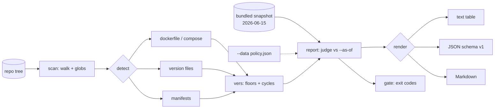

# eolvet

[English](README.md) | [中文](README.zh.md) | [日本語](README.ja.md)

[](LICENSE) [](go.mod) [](CHANGELOG.md)  [](CONTRIBUTING.md)

**eolvet：an open-source, zero-dependency CLI that scans repos and Dockerfiles for end-of-life runtimes, distros, and base images — fully offline, against a bundled, versioned EOL snapshot, so every audit answer is dated and reproducible.**


```bash
git clone https://github.com/JaydenCJ/eolvet && cd eolvet
go build -o eolvet ./cmd/eolvet    # single static binary, stdlib only
```

> Pre-release: v0.1.0 is not tagged on a package registry yet; build from source as above (any Go ≥1.22).

## Why eolvet?

Every post-2025 CVE retrospective ends the same way: the vulnerable thing was a runtime or base image that had been end-of-life for months, and nobody had a routine way to notice. The existing answers all have the same two problems. They call a web API at scan time (xeol queries endoflife.date, so your CI needs egress, the answer changes under you, and air-gapped environments are out), or they cover one ecosystem and stop at one file type. Meanwhile the question a compliance or platform team actually asks is boring and repo-shaped: *"as of this date, does this repository declare anything that is already EOL — and can I get the same answer tomorrow?"* eolvet answers exactly that. It walks the repo, reads what files really declare — multi-stage Dockerfiles with ARG substitution, compose files, `.nvmrc`/`.python-version`/`.tool-versions`, `go.mod`, `package.json` engines, `pyproject.toml`, `Gemfile`, `composer.json` — and judges every declaration against an EOL table embedded in the binary, stamped with its snapshot date. No network, no drift: the report says which snapshot judged it, as of which date, with the file:line and the exact declaration quoted. When a tag decomposes (`python:3.8-slim-bullseye` is an EOL Python *and* an expiring Debian), you get both findings; when a version cannot be resolved offline (`redis:latest`), you get an explained `unknown` instead of a guess.

| | eolvet | xeol | endoflife.date API | spreadsheet audits |
|---|---|---|---|---|
| Works fully offline / air-gapped | ✅ bundled snapshot | ❌ queries API | ❌ is the API | ✅ |
| Reproducible: dated snapshot + `--as-of` | ✅ | ❌ answers drift | ❌ answers drift | ❌ ad-hoc |
| Reads repo files (Dockerfile, manifests, pins) | ✅ 15 file types | ⚠️ images/SBOM | ❌ lookup only | ❌ manual |
| Splits image tags into runtime + base OS | ✅ | ❌ | ❌ | ❌ |
| Constraint floors (`>=18 <21` → judge 18) | ✅ | ❌ | ❌ | ❌ |
| Policy gate with exit codes for CI | ✅ `--fail-on`, `--strict` | ✅ | ❌ | ❌ |
| Bring-your-own lifecycle policy | ✅ `--data policy.json` | ❌ | ❌ | ✅ |
| Runtime dependencies | 0 (Go stdlib) | Go + API access | n/a | n/a |

<sub>Checked 2026-07-12: eolvet imports the Go standard library only; xeol requires network access to endoflife.date at scan time for current data.</sub>

## Features

- **Versioned EOL snapshot, in the binary** — 21 products, 113 release cycles (Python, Node.js, Go, Java, Ruby, PHP, .NET, Ubuntu, Debian, Alpine, CentOS, Rocky, Alma, Amazon Linux, PostgreSQL, MySQL, MariaDB, MongoDB, Redis, nginx, HAProxy), validated at load time and stamped `2026-06-15` in every report.
- **Dockerfiles read the way Docker reads them** — multi-stage aware, ARG defaults substituted (`${PY}`, `${PY:-3.9}`), line continuations joined, `--platform` skipped, registries and `library/` normalized, stage references and `scratch` ignored.
- **Tags decompose into every exposure** — `python:3.8-slim-bullseye` reports Python 3.8 *and* Debian 11; `golang:1.20-alpine3.17` reports Go 1.20 *and* Alpine 3.17; codenames (`jammy`, `bookworm`) resolve from the snapshot's tables.
- **Constraint floors, not guesses** — `>=18.17 <21`, `^3.10`, `~> 3.1`, and `18.x` resolve to the oldest version they allow, because that version bounds your exposure; unbounded ranges (`*`) surface as explained unknowns.
- **Reproducible by construction** — `--as-of 2026-07-13` pins the judgment date; identical tree + snapshot + date give byte-identical reports, so yesterday's audit can be re-verified letter for letter.
- **A gate CI can trust** — exit 1 on `--fail-on eol` (default) or `eol-soon`, `--strict` makes unknowns fail too, exit codes 0/1/2/3 are documented and stable; text, JSON (`schema_version: 1`), and Markdown output.
- **Your policy, same engine** — `--data policy.json` swaps in an organization's own lifecycle table (same schema, same validation), for internal support contracts that differ from upstream dates.

## Quickstart

```bash
# build the demo repository (EOL, expiring, supported, and unknown declarations)
bash examples/make-demo-repo.sh /tmp/eolvet-demo
./eolvet scan --as-of 2026-07-13 /tmp/eolvet-demo
```

Real captured output:

```text
eolvet scan — /tmp/eolvet-demo (snapshot 2026-06-15, as of 2026-07-13)

STATUS    PRODUCT     CYCLE  EOL         DAYS    WHERE                 DECLARED
EOL       Python      3.8    2024-10-07  -644d   Dockerfile:3          python:${PY}-slim-bullseye
EOL       PostgreSQL  12     2024-11-14  -606d   docker-compose.yml:3  postgres:12
EOL       Python      2.7    2020-01-01  -2385d  legacy/Dockerfile:1   python:2.7
EOL       Node.js     18     2025-04-30  -439d   web/.nvmrc:1          18.16.0
EOL       Node.js     18     2025-04-30  -439d   web/package.json:3    >=18.17 <21  (floor of constraint >=18.17 <21)
EOL-SOON  Debian      11     2026-08-31  +49d    Dockerfile:3          python:${PY}-slim-bullseye  (base OS of image tag)
UNKNOWN   Redis       —      —           —       docker-compose.yml:5  redis:latest  (unpinned tag; resolves to a different release over time)
OK        Go          1.26   2027-02-09  +211d   go.mod:3              go 1.26  (go directive)

8 declarations: 5 eol, 1 eol-soon, 1 supported, 1 unknown
```

One-off lookups use the same table and date math (`eolvet check`, real output):

```text
$ eolvet check node 16 --as-of 2026-07-13
Node.js 16 — EOL since 2023-09-11, 1036 days ago (as of 2026-07-13; snapshot 2026-06-15)
$ echo $?
1
```

## Detectors

Every detector reports only what a file actually declares; unresolvable versions become explained unknowns, and files eolvet has no lifecycle data for are skipped silently.

| File | What is read | Source id |
|---|---|---|
| `Dockerfile`, `Dockerfile.*`, `*.dockerfile` | every `FROM` (ARG-substituted, multi-stage aware) + tag base-OS suffixes | `dockerfile` |
| `docker-compose.yml` / `compose.yaml` (and `.yml`/`.yaml` variants) | `image:` lines, `${VAR:-default}` resolved | `compose` |
| `.python-version`, `.nvmrc`, `.node-version`, `.ruby-version`, `.go-version`, `.java-version` | the pinned version (aliases like `lts/hydrogen` skipped) | `version-file` |
| `.tool-versions` (asdf/mise) | every tool with lifecycle data; first version wins | `tool-versions` |
| `runtime.txt` (Heroku style) | `python-3.8.10` and friends | `runtime-txt` |
| `go.mod` | `go` directive; `toolchain` wins when present | `go-mod` |
| `package.json` | `engines.node` constraint floor | `package-json` |
| `pyproject.toml` | `requires-python` (PEP 621) or Poetry's `python` | `pyproject` |
| `Gemfile` | `ruby "…"` pin or constraint | `gemfile` |
| `composer.json` | `require.php` constraint floor | `composer-json` |

## CLI reference

`eolvet [scan|check|products|version] [flags] [path]` — `scan` is the default. Exit codes: 0 ok, 1 policy breach, 2 usage error, 3 runtime error.

| Flag | Default | Effect |
|---|---|---|
| `--format` | `text` | `text`, `json`, or `markdown` (`products`: `text`/`json`) |
| `--as-of` | today (UTC) | judge as of `YYYY-MM-DD` — pin it for reproducible audits |
| `--warn-within` | `90` | days before EOL that a finding counts as `eol-soon` |
| `--fail-on` | `eol` | breach threshold: `eol`, `eol-soon`, or `none` |
| `--strict` | off | `unknown` findings also breach (what you cannot date, you cannot pass) |
| `--exclude` | — | skip paths matching a glob, `**` supported (repeatable) |
| `--data` | bundled | use your own snapshot file instead of the embedded table |
| `--max-file-size` | `1048576` | skip files larger than N bytes |

The bundled table is inspectable (`eolvet products`) and replaceable — the schema, validation rules, and matching semantics are documented in [docs/snapshot-format.md](docs/snapshot-format.md). This repository ships no CI; every claim above is verified by local runs: `go test ./...` (90 deterministic tests, offline, < 5 s) then `bash scripts/smoke.sh` (prints `SMOKE OK`).

## Architecture



## Roadmap

- [x] v0.1.0 — bundled validated snapshot (21 products), 15 file-type detectors with ARG substitution and tag decomposition, constraint floors, `--as-of` reproducibility, text/JSON/Markdown reports, `--fail-on`/`--strict` gate, `check` + `products`, 90 tests + smoke script
- [ ] `eolvet diff` — compare two reports (or two snapshots) and show what newly expired
- [ ] More detectors: GitHub Actions `runs-on`/`setup-*` versions, `.terraform-version`, Kubernetes manifests
- [ ] Extended-support awareness (Ubuntu Pro / RHEL ELS) as a separate, honest status
- [ ] Signed snapshot releases on a predictable cadence, with `eolvet snapshot verify`
- [ ] SPDX/CycloneDX SBOM input mode for scanning build artifacts, not just sources

See the [open issues](https://github.com/JaydenCJ/eolvet/issues) for the full list.

## Contributing

Issues, discussions and pull requests are welcome — see [CONTRIBUTING.md](CONTRIBUTING.md) for the local workflow (format, vet, tests, `SMOKE OK`) and the rules for snapshot data changes. Good entry points are labelled [good first issue](https://github.com/JaydenCJ/eolvet/issues?q=is%3Aissue+is%3Aopen+label%3A%22good+first+issue%22), and design questions live in [Discussions](https://github.com/JaydenCJ/eolvet/discussions).

## License

[MIT](LICENSE)
