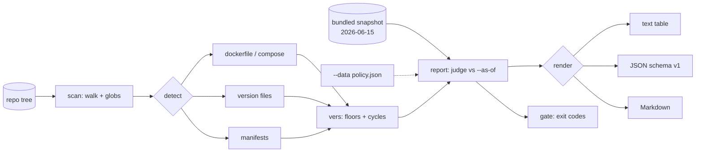

# eolvet

[English](README.md) | [中文](README.zh.md) | [日本語](README.ja.md)

[](LICENSE) [](go.mod) [](CHANGELOG.md)  [](CONTRIBUTING.md)

**eolvet：一个开源、零依赖的 CLI，扫描仓库和 Dockerfile 中已到生命周期终点（EOL）的运行时、发行版与基础镜像——完全离线，基于内置的带版本 EOL 快照，让每一次审计结论都有日期、可复现。**


```bash
git clone https://github.com/JaydenCJ/eolvet && cd eolvet
go build -o eolvet ./cmd/eolvet    # single static binary, stdlib only
```

> 预发布：v0.1.0 尚未发布到任何包仓库；请按上述方式从源码构建（任意 Go ≥1.22）。

## 为什么选择 eolvet？

2025 年之后的每一份 CVE 复盘都以同样的方式收尾：出事的组件是一个早已 EOL 数月的运行时或基础镜像，而没有人有例行手段去发现它。现有方案都带着同样的两个问题：要么在扫描时调用 Web API（xeol 查询 endoflife.date，于是 CI 需要出网、答案会随时间漂移、隔离网络环境直接出局），要么只覆盖一个生态、只认一种文件。而合规团队和平台团队真正要问的问题其实很朴素、以仓库为单位：*“截至这个日期，这个仓库声明的东西里有没有已经 EOL 的——而且明天还能得到同样的答案吗？”* eolvet 回答的正是这个问题。它遍历仓库，读取文件真实声明的内容——带 ARG 替换的多阶段 Dockerfile、compose 文件、`.nvmrc`/`.python-version`/`.tool-versions`、`go.mod`、`package.json` engines、`pyproject.toml`、`Gemfile`、`composer.json`——并用编译进二进制、盖着快照日期戳的 EOL 表来判定每一条声明。没有网络、没有漂移：报告写明由哪个快照、以哪一天为基准做出判定，并附上 file:line 和原样引用的声明。当一个镜像标签可以拆解时（`python:3.8-slim-bullseye` 既是 EOL 的 Python *又是*即将到期的 Debian），两个发现都会报告；当版本离线无法解析时（`redis:latest`），你得到的是带解释的 `unknown`，而不是猜测。

| | eolvet | xeol | endoflife.date API | 表格式人工审计 |
|---|---|---|---|---|
| 完全离线 / 隔离网络可用 | ✅ 内置快照 | ❌ 调用 API | ❌ 本身就是 API | ✅ |
| 可复现：带日期快照 + `--as-of` | ✅ | ❌ 答案漂移 | ❌ 答案漂移 | ❌ 随手为之 |
| 读取仓库文件（Dockerfile、清单、版本 pin） | ✅ 15 种文件 | ⚠️ 镜像/SBOM | ❌ 仅查询 | ❌ 纯手工 |
| 把镜像标签拆成运行时 + 基础 OS | ✅ | ❌ | ❌ | ❌ |
| 约束下界（`>=18 <21` → 按 18 判定） | ✅ | ❌ | ❌ | ❌ |
| 面向 CI 的退出码策略闸门 | ✅ `--fail-on`、`--strict` | ✅ | ❌ | ❌ |
| 自带组织生命周期策略 | ✅ `--data policy.json` | ❌ | ❌ | ✅ |
| 运行时依赖 | 0（Go 标准库） | Go + 需要网络 | n/a | n/a |

<sub>核对于 2026-07-12：eolvet 只导入 Go 标准库；xeol 在扫描时需要访问 endoflife.date 才能拿到最新数据。</sub>

## 功能特性

- **快照带版本、编译进二进制** — 21 个产品、113 条发布周期（Python、Node.js、Go、Java、Ruby、PHP、.NET、Ubuntu、Debian、Alpine、CentOS、Rocky、Alma、Amazon Linux、PostgreSQL、MySQL、MariaDB、MongoDB、Redis、nginx、HAProxy），加载时严格校验，每份报告都盖着 `2026-06-15` 的戳。
- **按 Docker 的方式读 Dockerfile** — 感知多阶段构建，替换 ARG 默认值（`${PY}`、`${PY:-3.9}`），拼接续行，跳过 `--platform`，归一化 registry 与 `library/`，忽略阶段引用和 `scratch`。
- **标签拆解出每一处暴露** — `python:3.8-slim-bullseye` 同时报告 Python 3.8 *和* Debian 11；`golang:1.20-alpine3.17` 同时报告 Go 1.20 *和* Alpine 3.17；代号（`jammy`、`bookworm`）由快照内的表解析。
- **求约束下界，而不是猜** — `>=18.17 <21`、`^3.10`、`~> 3.1`、`18.x` 都解析为其允许的最老版本，因为正是它决定你的暴露面；无下界的范围（`*`）以带解释的 unknown 呈现。
- **可复现是构造出来的** — `--as-of 2026-07-13` 固定判定日期；相同的目录树 + 快照 + 日期产生逐字节一致的报告，昨天的审计今天可以逐字复核。
- **CI 敢信的闸门** — `--fail-on eol`（默认）或 `eol-soon` 时退出码 1，`--strict` 让 unknown 也算失败，退出码 0/1/2/3 有文档且稳定；输出 text、JSON（`schema_version: 1`）、Markdown 三种格式。
- **你的策略，同一引擎** — `--data policy.json` 换上组织自己的生命周期表（同一 schema、同一校验），适配与上游日期不同的内部支持合同。

## 快速上手

```bash
# build the demo repository (EOL, expiring, supported, and unknown declarations)
bash examples/make-demo-repo.sh /tmp/eolvet-demo
./eolvet scan --as-of 2026-07-13 /tmp/eolvet-demo
```

真实捕获的输出：

```text
eolvet scan — /tmp/eolvet-demo (snapshot 2026-06-15, as of 2026-07-13)

STATUS    PRODUCT     CYCLE  EOL         DAYS    WHERE                 DECLARED
EOL       Python      3.8    2024-10-07  -644d   Dockerfile:3          python:${PY}-slim-bullseye
EOL       PostgreSQL  12     2024-11-14  -606d   docker-compose.yml:3  postgres:12
EOL       Python      2.7    2020-01-01  -2385d  legacy/Dockerfile:1   python:2.7
EOL       Node.js     18     2025-04-30  -439d   web/.nvmrc:1          18.16.0
EOL       Node.js     18     2025-04-30  -439d   web/package.json:3    >=18.17 <21  (floor of constraint >=18.17 <21)
EOL-SOON  Debian      11     2026-08-31  +49d    Dockerfile:3          python:${PY}-slim-bullseye  (base OS of image tag)
UNKNOWN   Redis       —      —           —       docker-compose.yml:5  redis:latest  (unpinned tag; resolves to a different release over time)
OK        Go          1.26   2027-02-09  +211d   go.mod:3              go 1.26  (go directive)

8 declarations: 5 eol, 1 eol-soon, 1 supported, 1 unknown
```

单次查询使用同一张表和同样的日期算术（`eolvet check`，真实输出）：

```text
$ eolvet check node 16 --as-of 2026-07-13
Node.js 16 — EOL since 2023-09-11, 1036 days ago (as of 2026-07-13; snapshot 2026-06-15)
$ echo $?
1
```

## 检测器

每个检测器只报告文件真实声明的内容；无法解析的版本成为带解释的 unknown，没有生命周期数据的文件则被静默跳过。

| 文件 | 读取内容 | Source id |
|---|---|---|
| `Dockerfile`、`Dockerfile.*`、`*.dockerfile` | 每条 `FROM`（ARG 已替换、感知多阶段）+ 标签中的基础 OS 后缀 | `dockerfile` |
| `docker-compose.yml` / `compose.yaml`（含 `.yml`/`.yaml` 变体） | `image:` 行，解析 `${VAR:-default}` | `compose` |
| `.python-version`、`.nvmrc`、`.node-version`、`.ruby-version`、`.go-version`、`.java-version` | 固定的版本号（`lts/hydrogen` 之类别名跳过） | `version-file` |
| `.tool-versions`（asdf/mise） | 每个有生命周期数据的工具；第一个版本生效 | `tool-versions` |
| `runtime.txt`（Heroku 风格） | `python-3.8.10` 等 | `runtime-txt` |
| `go.mod` | `go` 指令；存在 `toolchain` 时以其为准 | `go-mod` |
| `package.json` | `engines.node` 约束下界 | `package-json` |
| `pyproject.toml` | `requires-python`（PEP 621）或 Poetry 的 `python` | `pyproject` |
| `Gemfile` | `ruby "…"` 的 pin 或约束 | `gemfile` |
| `composer.json` | `require.php` 约束下界 | `composer-json` |

## CLI 参考

`eolvet [scan|check|products|version] [flags] [path]` — 默认子命令为 `scan`。退出码：0 正常，1 策略违规，2 用法错误，3 运行时错误。

| 参数 | 默认值 | 作用 |
|---|---|---|
| `--format` | `text` | `text`、`json` 或 `markdown`（`products`：`text`/`json`） |
| `--as-of` | 今天（UTC） | 以 `YYYY-MM-DD` 为基准判定——固定它即可复现审计 |
| `--warn-within` | `90` | 距 EOL 多少天内计为 `eol-soon` |
| `--fail-on` | `eol` | 违规阈值：`eol`、`eol-soon` 或 `none` |
| `--strict` | 关 | `unknown` 也算违规（无法标注日期的东西不能放行） |
| `--exclude` | — | 跳过匹配 glob 的路径，支持 `**`（可重复） |
| `--data` | 内置 | 用你自己的快照文件替换内嵌表 |
| `--max-file-size` | `1048576` | 跳过大于 N 字节的文件 |

内置表可查看（`eolvet products`）也可替换——schema、校验规则与匹配语义见 [docs/snapshot-format.md](docs/snapshot-format.md)。本仓库不带 CI；以上所有断言均由本地运行验证：`go test ./...`（90 个确定性测试，离线，< 5 s），然后 `bash scripts/smoke.sh`（打印 `SMOKE OK`）。

## 架构



## 路线图

- [x] v0.1.0 — 内置且经校验的快照（21 个产品）、15 种文件检测器（含 ARG 替换与标签拆解）、约束下界、`--as-of` 可复现、text/JSON/Markdown 报告、`--fail-on`/`--strict` 闸门、`check` + `products`、90 个测试 + smoke 脚本
- [ ] `eolvet diff` — 对比两份报告（或两个快照），列出新过期的条目
- [ ] 更多检测器：GitHub Actions 的 `runs-on`/`setup-*` 版本、`.terraform-version`、Kubernetes 清单
- [ ] 感知延长支持（Ubuntu Pro / RHEL ELS），作为独立、诚实的状态
- [ ] 按可预期节奏发布带签名的快照，并提供 `eolvet snapshot verify`
- [ ] SPDX/CycloneDX SBOM 输入模式，让构建产物（不只是源码）也可扫描

完整列表见 [open issues](https://github.com/JaydenCJ/eolvet/issues)。

## 参与贡献

欢迎 issue、讨论与 PR——本地工作流（格式化、vet、测试、`SMOKE OK`）及快照数据变更规则见 [CONTRIBUTING.md](CONTRIBUTING.md)。入门任务见 [good first issue](https://github.com/JaydenCJ/eolvet/issues?q=is%3Aissue+is%3Aopen+label%3A%22good+first+issue%22) 标签，设计问题请到 [Discussions](https://github.com/JaydenCJ/eolvet/discussions)。

## 许可证

[MIT](LICENSE)
